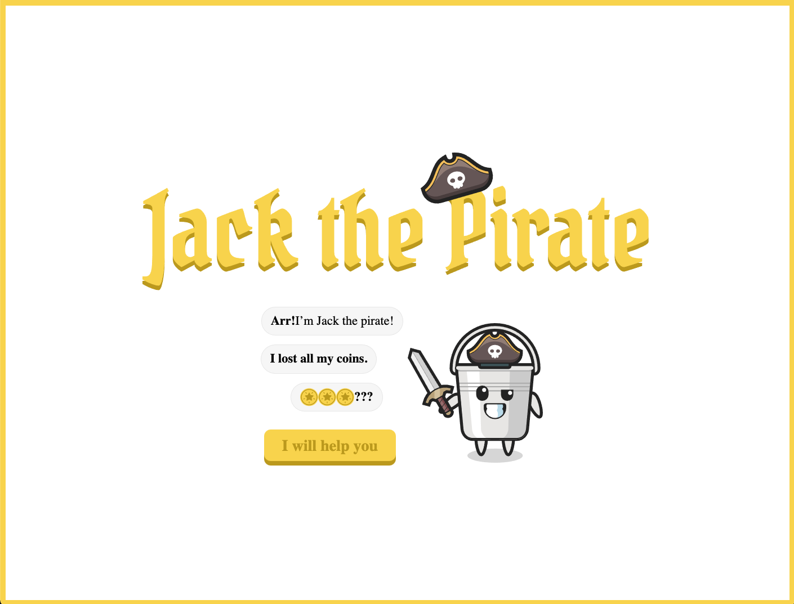
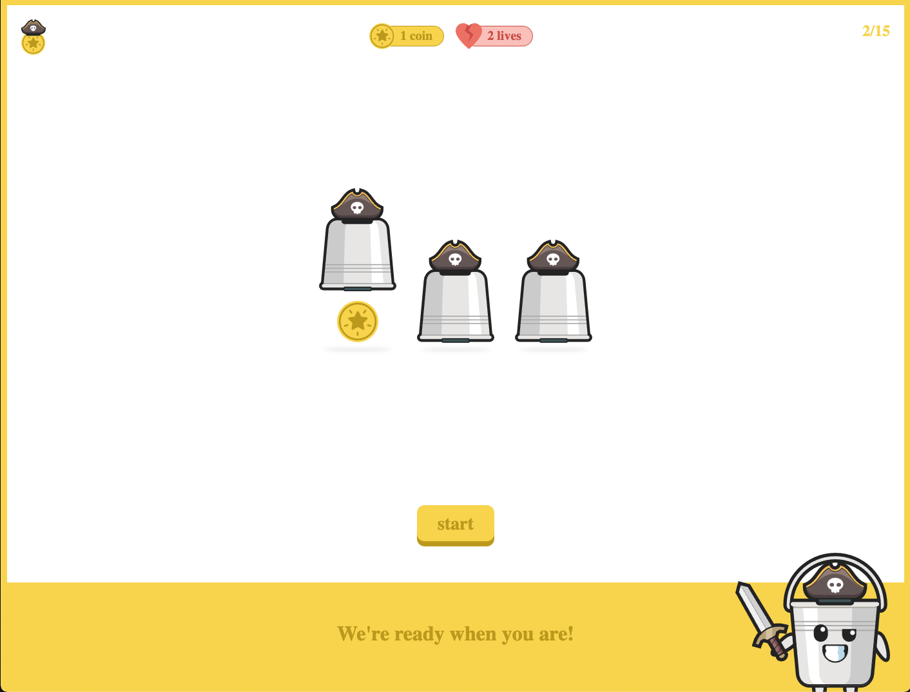
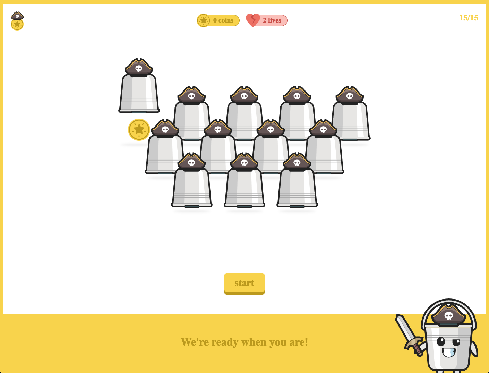

# Pirate Shuffle game
Jack the pirate has lost his coins and they are hidden away in buckets. You can help him find them?

## Stack
- React
- Styled-components
- react-canvas-confetti
- valtio
- typescript

## Time spent
- Design (1 hour)
- Game logic (2-3 hours)
- UI / Design implementation (2 hours)

## Device support
- Browser

## Start the app
- `yarn`
- `yarn start`

## Code explained
For this project I decided to go with:

### React
It is easy to work with, powerfull enough for a simple game and fullfills the requirement "UI as a function of state"

### Styled-components
Styled components is a "css-in-js" styling option that works well with React, allows for tight coupling the css to components without the extra layer of css classes.
It also allows passing variables and logic.

### Valtio
Valtio is a simple state management proxy, it allows for direct manipluation and a reactive UI. 
As the game only stores a tiny bit of data, has simple logic and bennefits from seperated logic with a reactive UI Valtio is a good option.

### React-scripts
A simple way of setting up a simple react project without needing to setup webpack/babel or any packager.

### Typescript
Typescript adds a strongly types layer ontop of javascript to help developers create better code

## Expansion
The levels of the game can be expanded by adjusting the logic of `setupLevelConfig` in `src/state/game/setupLevel.tsx`. This function determines the amount of cups, rows, shuffles and shuffle speed.

## File structure
- `/public` - All publicly available files on the web, mostly images.
- `/src/components` - All the individual UI components
- `/src/state` - The store/data state of the app, including action.
- `/src/state/game` - A collection of functions to help perform game logic found in the actions
- `/src/App.tsx` - The main app component, the starting place of the app.
- `/styles.tsx` - A collection of global css styles, like a reset, and the theme with colors/color presets 

### Screenshots

